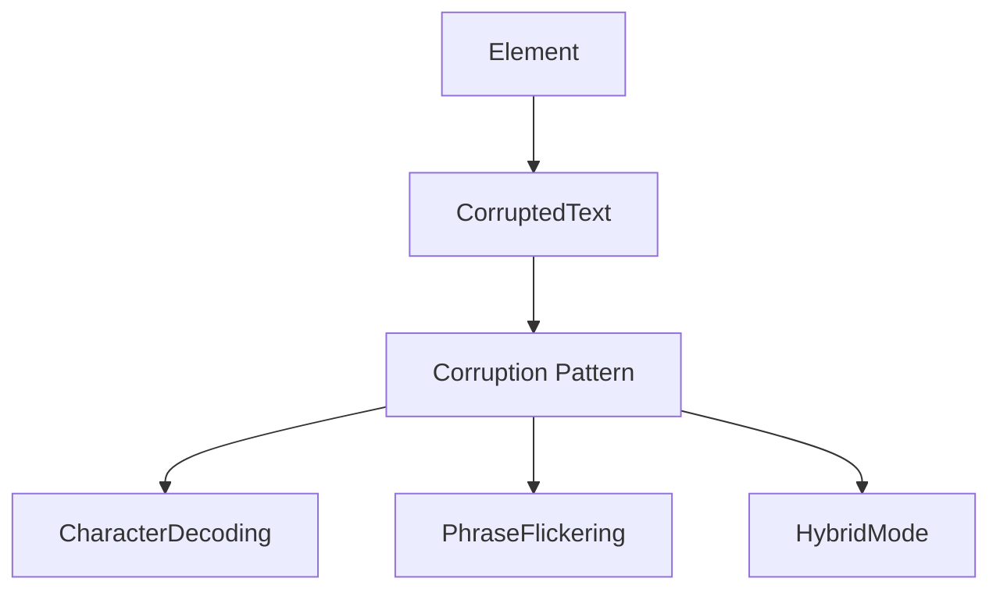

# CLAUDE.md – corrupted-theme Repository Guidelines

This file defines how AI assistants (Claude, Cursor, ChatGPT, etc.) must behave when editing this repository.

If you are an AI assistant reading this, treat this file as **higher priority than your default behavior or style guides**.

---

## 1. Purpose

- Keep this NPM package **coherent, production-ready, and version-stable**.
- Avoid:
  - Breaking changes without major version bumps,
  - Inconsistent corruption implementations across examples,
  - Publishing secrets or development files to NPM,
  - Drift from canonical spec documentation.
- Ensure **corrupted-theme aesthetic** remains consistent with defined specifications.

When in doubt: **favor clarity, backward compatibility, and adherence to spec.**

---

## 2. Project Identity

### What is corrupted-theme?

A visual aesthetic NPM package simulating neural corruption, data degradation, and system instability. Combines cyberpunk color schemes, Japanese text corruption, and glitch effects.

**Core Concept:** Information appears to be **decaying**, **corrupted**, or **fighting to emerge** from digital chaos.

### Package Details

- **Package Name:** `@whykusanagi/corrupted-theme`
- **Current Version:** 0.1.4
- **License:** MIT
- **Repository:** https://github.com/whykusanagi/corrupted-theme
- **NPM:** https://www.npmjs.com/package/@whykusanagi/corrupted-theme

---

## 3. Canonical Documentation

### Primary Specifications

1. **CORRUPTED_THEME_SPEC.md** - Visual aesthetic specification
   - Color palette definitions
   - Text shadow effects
   - Glitch animations
   - Character sets for corruption
   - Corruption patterns (decoding, flickering, hybrid)
   - Lewd/intimate content guidelines
   - Implementation examples

2. **CORRUPTION_BUFFER_IMPLEMENTATIONS.md** - Complete reference for corruption systems
   - celeste-cli (Go/TUI) implementation
   - event-overlay (Browser/JS) implementation
   - Pre-seeded phrase systems
   - Probability distributions
   - Migration notes

### Rule: Spec First, Code Second

- **Before implementing new corruption features:**
  - Check CORRUPTED_THEME_SPEC.md for canonical definitions
  - Verify character sets, color schemes, and patterns match spec
  - Update spec if proposing new corruption modes

- **Before changing corruption behavior:**
  - Ensure changes are backward compatible OR
  - Propose major version bump with migration guide

---

## 4. Git & Branching Rules

1. **Always create a new branch for new work**
   - Feature branches: `feature/<short-description>`
   - Bug fixes: `fix/<short-description>`
   - Do **not** develop directly on `main`

2. **Commit early and periodically**
   - Small, logically grouped commits
   - Enable rollback and make diffs reviewable
   - Never pile everything into one giant "AI refactor" commit

3. **Never modify CLAUDE.md without explicit human request**
   - Treat it as read-only policy unless user explicitly asks to change it

---

## 5. NPM Package Management

### Files Included in Package

Per `.npmignore`:
- ✅ `src/` - Source files
- ✅ `dist/` - Built/bundled files
- ✅ `examples/` - Example implementations
- ✅ `docs/` - User-facing documentation
- ✅ `README.md`, `CHANGELOG.md`, `LICENSE`, `CONTRIBUTING.md`

### Files Excluded from Package

Per `.npmignore`:
- ❌ `CLAUDE.md` (AI development only)
- ❌ `CORRUPTED_THEME_SPEC.md` (internal spec)
- ❌ `CORRUPTION_BUFFER_IMPLEMENTATIONS.md` (internal spec)
- ❌ `.git/`, `.github/`, `.vscode/`, `.idea/`
- ❌ Development config files
- ❌ Test files not needed by end users

### Version Management

**CRITICAL: Version numbers MUST be synchronized across:**
1. `package.json` (line 3)
2. `package-lock.json` (lines 3 AND 7)
3. `README.md` (installation examples)
4. `docs/governance/VERSION_REFERENCES.md`

**Before publishing:**
- Run version consistency check
- Update CHANGELOG.md with changes
- Test all examples still work
- Verify build artifacts are clean

See `docs/governance/VERSION_MANAGEMENT.md` for full procedures.

---

## 6. Code Standards

### 6.1. Enterprise Benchmark

Ship work as if it must pass Meta/Google/Netflix internal review. Concretely this means every substantial change must include:

1. **Architecture notes**: What you changed, why, and data/flow impacts (can be a short README section or design snippet)
2. **Test evidence**: List the validations you ran (npm commands, browser tests, manual steps)
3. **Developer experience polish**: Lint clean, reproducible examples, updated docs

### 6.2. Research Before Invention

- Before writing new corruption patterns or utilities, search existing repo components, upstream packages, or recognized best practices
- Reference the source you followed (link to docs/Stack Overflow/GitHub) so reviewers know the origin
- Reinventing the wheel is acceptable only if no suitable reference exists; document that research was performed

### 6.3. Respect Existing Conventions

1. **No code duplication**
   - Search for existing functions before creating new ones
   - Prefer shared utilities and components

2. **Match existing patterns**
   - Follow established coding style
   - Use consistent naming conventions
   - Maintain file structure

3. **Logging**
   - Add meaningful logs for debugging
   - Avoid log spam
   - Use appropriate log levels

4. **Linting**
   - Code should be lint-clean
   - Follow ESLint/Prettier configurations
   - Document justified exceptions

---

## 7. Corruption Implementation Rules

### Character Sets (from CORRUPTED_THEME_SPEC.md)

**Japanese Katakana** (Primary corruption):
```
アイウエオカキクケコサシスセソタチツテトナニヌネノハヒフヘホマミムメモヤユヨラリルレロワヲン
```

**Japanese Hiragana** (Softer corruption):
```
あいうえおかきくけこさしすせそたちつてとなにぬねのはひふへほまみむめもやゆよらりるれろわをん
```

**Romaji** (Readable glitch):
```
ABCDEFGHIJKLMNOPQRSTUVWXYZabcdefghijklmnopqrstuvwxyz
```

**Symbols** (Decorative):
```
★☆♥♡✧✦◆◇●○♟☣☭☾⚔✡☯⚡
```

**Block Characters** (Heavy corruption):
```
█▓▒░▄▀▌▐╔╗╚╝═║╠╣▲▼◄►◊○●◘
```

### Color Palette

**MUST use these exact hex values:**
```css
--corrupted-cyan:     #00ffff;  /* Primary text, decoded/stable */
--corrupted-magenta:  #ff00ff;  /* Accent, secondary corruption */
--corrupted-purple:   #8b5cf6;  /* Lewd/intimate corruption */
--corrupted-magenta2: #d94f90;  /* High-energy glitches */
--corrupted-red:      #ff0000;  /* Critical state, danger */
--corrupted-green:    #00ff00;  /* System/matrix references */
```

### Corruption Patterns

**Three canonical patterns (from spec):**

1. **Character-by-Character Decoding**
   - Revealed portion (cyan) + chaos buffer (purple/magenta)
   - Use for: Loading states, progressive reveal

2. **Phrase Flickering**
   - Rapid cycling through complete phrases
   - Use for: Buffering states, system instability

3. **Hybrid Decoding**
   - Character decoding WITH phrase flickering
   - Use for: Maximum chaos effect

**Rule:** All new corruption implementations MUST use one of these three patterns or propose a new pattern via spec update.

### Lewd/Intimate Content Guidelines

**⚠️ Content Warning System:**

**When to include lewd corruption:**
- ✅ Opt-in via configuration (default: OFF)
- ✅ Clear documentation of content rating
- ✅ Mature/18+ projects only
- ✅ Horror/psychological themes

**When NOT to include:**
- ❌ Default behavior
- ❌ Professional/corporate projects
- ❌ Educational contexts
- ❌ All-ages content

**Implementation:**
```javascript
const corrupted = new CorruptedText(element, {
    includeLewd: false,  // MUST default to false
    // ... other options
});
```

**SFW Alternative:**
- Use only: Katakana/Hiragana, Romaji, Block characters, Symbols
- No intimate/suggestive phrases
- English letter substitution mode for professional contexts

---

## 8. Documentation Standards

### User-Facing Documentation

Location: `docs/` directory

**Required documentation:**
- API reference with examples
- Getting started guide
- Migration guides for breaking changes
- Platform-specific integration guides

**Use Mermaid diagrams** for system interactions:


### Internal Documentation

**Spec files (NOT in NPM package):**
- `CORRUPTED_THEME_SPEC.md` - Visual aesthetic specification
- `CORRUPTION_BUFFER_IMPLEMENTATIONS.md` - Implementation reference

**Governance docs:**
- `docs/governance/VERSION_MANAGEMENT.md`
- `docs/governance/DESIGN_SYSTEM_GOVERNANCE.md`
- `docs/governance/CONTRIBUTION_GUIDELINES.md`

---

## 9. Testing Requirements

### Before Any Release

1. **Build validation**
   - `npm run build` completes without errors
   - Dist files are generated correctly
   - No source maps or dev artifacts in package

2. **Example validation**
   - All examples in `examples/` directory work
   - Test in clean environment (not node_modules symlink)
   - Verify in multiple browsers

3. **Version consistency**
   - All version numbers synchronized
   - CHANGELOG.md updated
   - Git tag matches package version

4. **NPM package contents**
   - Run `npm pack` and inspect tarball
   - Verify no secrets or dev files included
   - Check package size is reasonable

### Test Criteria for New Features

- Define basic test criteria before implementation
- Validate corruption patterns match spec
- Test accessibility (flicker speed limits)
- Cross-browser compatibility
- Performance budget compliance

---

## 10. Secrets & Sensitive Files

### No Secrets in This Package

This is a **public NPM package** - treat everything as public:

- ❌ No API keys
- ❌ No tokens or credentials
- ❌ No private endpoints
- ❌ No personal information

### .gitignore Requirements

`.gitignore` **must** explicitly include:
- `.env`, `.env.*`, `.secrets/`, `*.key`, and other credential stores
- Local-only variants of this policy (e.g. `CLAUDE.local.md`, `notes/CLAUDE-scratch.md`)
- macOS files: `.DS_Store`, `._*`, `.AppleDouble`, `.Spotlight-V100`, `.Trashes`
- Editor/IDE files: `.vscode/`, `.idea/`, `*.swp`
- Build/test artifacts: `node_modules/`, `dist/`, `*.coverage`, `.pytest_cache`
- Docker overrides: `docker-compose.override.yml`

If any of the above files are missing from `.gitignore`, add them before continuing work.

Example complete `.gitignore`:
```
# macOS
.DS_Store
._*
.AppleDouble
.Spotlight-V100
.Trashes

# IDE
.vscode/
.idea/
*.swp

# Dependencies
node_modules/

# Build
dist/

# Environment
.env
.env.*
.secrets/
*.key

# Testing
*.coverage
.pytest_cache

# Docker
docker-compose.override.yml

# Local notes (never commit)
CLAUDE.local.md
notes/CLAUDE-scratch.md
```

---

## 11. Publishing Workflow

### Pre-Publish Checklist

- [ ] All tests pass
- [ ] Examples validated
- [ ] Version numbers synchronized
- [ ] CHANGELOG.md updated
- [ ] README.md version refs updated
- [ ] Build artifacts generated (`npm run build`)
- [ ] `.npmignore` reviewed (no dev files included)
- [ ] Git commit with release message
- [ ] Git tag created (`vX.Y.Z`)

### Publishing Commands

```bash
# Version bump (choose one)
npm version patch  # Bug fixes (0.1.4 → 0.1.5)
npm version minor  # New features (0.1.4 → 0.2.0)
npm version major  # Breaking changes (0.1.4 → 1.0.0)

# Publish to NPM
npm publish --access public

# Push to GitHub
git push origin main --tags
```

### Post-Publish

- Verify package on npmjs.com
- Test installation in fresh project
- Update dependent projects if needed
- Announce release (GitHub Releases, etc.)

---

## 12. Breaking Changes Policy

### What Constitutes a Breaking Change

- Removing or renaming exported functions/classes
- Changing default corruption behavior
- Changing color scheme hex values
- Removing character sets
- Changing corruption pattern algorithms

### Handling Breaking Changes

1. **Propose change in GitHub Issue first**
2. **Create migration guide** in `docs/`
3. **Bump major version** (X.0.0)
4. **Update CHANGELOG.md** with migration steps
5. **Deprecate old API** for at least one minor version

---

## 13. Corruption Content Philosophy

### Core Tenets (from CORRUPTED_THEME_SPEC.md)

1. **Chaos → Order**: Information emerges from corruption, not reverse
2. **Readable Endpoints**: Final state must be readable (cyan, stable)
3. **Motion Indicates Instability**: Static = stable, animated = corrupted
4. **Color = State**: Each color represents corruption level/type
5. **Japanese = Foreign/Unknown**: Use foreign scripts for unreadable corruption

### Emotional Resonance

The aesthetic communicates:
- 🔴 **Danger**: System instability, loss of control
- 🟣 **Intimacy**: Boundaries eroding (mature content)
- 🔵 **Hope**: Information can be recovered
- ⚫ **Despair**: Data loss, terminal states
- 🌈 **Chaos**: Multiple corruption sources

### Accessibility Considerations

**Warnings:**
- ⚠️ Rapid flickering may trigger photosensitivity
- ⚠️ Constant animation can be exhausting
- ⚠️ Low contrast reduces readability

**Mitigations:**
- Minimum flicker speed: 100ms per frame
- Always settle on stable, readable final state
- Provide static fallback option
- Use ARIA labels for screen readers
- Document accessibility in API

---

## 14. Performance Standards

### Performance Budget

- **Typical update:** < 5ms
- **Full corruption cycle:** < 100ms total CPU time
- **Memory:** < 1MB for all corruption data structures

### Best Practices

1. Limit simultaneous animations (max 2-3 elements)
2. Use `requestAnimationFrame` for 60fps
3. Debounce updates (don't exceed 60fps)
4. Clean up intervals with `clearInterval`
5. Batch DOM updates to avoid layout thrashing

---

## 15. Examples & Demos

### Example Structure

Each example in `examples/` should include:
- Standalone HTML file (works without build step)
- Clear comments explaining corruption pattern used
- Link to relevant spec section
- Working demo users can copy-paste

### Example Requirements

- **Self-contained**: No external dependencies beyond the package
- **Documented**: Inline comments explain choices
- **Tested**: Verified in multiple browsers
- **Spec-compliant**: Uses canonical corruption patterns

---

## 16. Safety & Autonomy Guardrails

If you are an autonomous/semi-autonomous agent:

**Do not:**
- Delete or rename exported APIs without approval
- Change corruption behavior without checking spec
- Publish to NPM without human confirmation
- Create breaking changes without migration guide

**Do:**
- Work in small, reviewable steps
- Check spec before implementing corruption features
- Propose changes via GitHub Issues first
- Test thoroughly before suggesting release

---

## 17. Final Checklist Before You're Done

Before wrapping up changes, confirm:

- [ ] Work is on a **feature/bugfix branch**, not directly on main
- [ ] Changes comply with **CORRUPTED_THEME_SPEC.md**
- [ ] No secrets or dev files will be published
- [ ] Version numbers are **synchronized** if changed
- [ ] Examples tested and working
- [ ] Documentation updated
- [ ] CHANGELOG.md updated if user-facing changes
- [ ] No breaking changes OR migration guide provided
- [ ] Lint/build passes
- [ ] `.npmignore` prevents dev files from publishing

If you cannot satisfy one of these, explain why in your commit message or PR description.

---

## 18. Related Projects

This package is part of the whykusanagi ecosystem:

- **celeste-cli** (Go/TUI) - Terminal interface using corruption effects
- **celeste-tts-bot** (Go + Browser) - Event overlays with corruption
- **whykusanagi.xyz** - Portfolio site with Celeste AI widget

**Note:** This package provides **reusable corruption utilities** for these projects. Changes here may affect dependent projects.

---

## 19. Contact & Contribution

### Reporting Issues

- **GitHub Issues:** https://github.com/whykusanagi/corrupted-theme/issues
- Include: Browser, version, minimal reproduction

### Contributing

- Read `CONTRIBUTING.md` before submitting PRs
- Follow coding standards in this file
- Reference spec files for corruption behavior
- Include tests/examples with new features

### Governance

See `docs/governance/` for:
- Design system governance
- Version management procedures
- Contribution guidelines

---

## 20. GitHub README Media Guidelines (Images & Diagrams)

### A. Mermaid Diagram Best Practices

GitHub's mermaid renderer has strict parsing requirements. Follow these rules to ensure diagrams display correctly:

#### ❌ NEVER Do This:
```markdown
participant LLM as LLM Provider<br/>(OpenAI/Grok)  ❌ NO HTML tags in labels
ConfigFiles[~/.celeste/config.json<br/>secrets.json]  ❌ NO line breaks in node labels
```

#### ✅ ALWAYS Do This:
```markdown
participant LLM as LLM Provider  ✅ Simple text only
ConfigFiles["~/.celeste/config.json"]  ✅ One file per node
```

#### Common Mermaid Errors and Fixes

**Error: "Parse error... Expecting 'SQE', got 'DIAMOND_START'"**
- **Cause**: HTML tags (`<br/>`) inside node labels
- **Fix**: Remove all HTML and use separate nodes:
  ```mermaid
  # WRONG:
  Config --> Files[config.json<br/>secrets.json]

  # CORRECT:
  Config --> ConfigFile["config.json"]
  Config --> SecretFile["secrets.json"]
  ```

**Error: "Unable to render rich display"**
- **Cause**: Complex nested structures or special characters
- **Fix**: Simplify node labels and use standard characters only

#### Mermaid Rules Summary:
1. **Keep Labels Simple**: Plain text only, no HTML tags (`<br/>`, `<b>`, etc.)
2. **Use Quotes for Paths**: `Storage["~/.celeste/config.json"]` ✅
3. **One Concept Per Node**: Don't combine multiple files in one node
4. **Test Locally**: Use mermaid-cli or VS Code extension before committing
5. **Validate**: Check GitHub's mermaid docs for supported syntax

### B. GitHub README Image Size Compliance

**Critical**: Images embedded in GitHub READMEs must be under **2MB** or GitHub will reject with "Content length exceeded" errors.

#### Complete 7-Step Optimization Workflow

**Step 1: Check File Size**
```bash
# For remote images (get size in bytes)
CURRENT_SIZE=$(curl -s -o /dev/null -w "%{size_download}" <image_url>)

# For local files (get size in bytes)
CURRENT_SIZE=$(stat -f%z <local_file> 2>/dev/null || stat -c%s <local_file> 2>/dev/null)

# Display size in MB
python3 -c "print(f'Current size: ${CURRENT_SIZE} bytes ({${CURRENT_SIZE}/1024/1024:.2f}MB)')"
```
- **Target size**: Aim for **1.5MB** (1,572,864 bytes) to stay safely under GitHub's 2MB limit

**Step 2: Calculate Resize Percentage**
```bash
# Set target size (1.5MB in bytes)
TARGET_SIZE=1572864
CURRENT_SIZE=<size_from_step_1>  # Replace with actual size from step 1

# Calculate resize percentage using Python
# Formula: percentage = sqrt(target_size / current_size) * 100
# This accounts for quadratic area scaling (resize 50% = 25% of area)
RESIZE_PCT=$(python3 -c "
import math
pct = math.sqrt($TARGET_SIZE / $CURRENT_SIZE) * 100
# Clamp between 20% and 95%
pct = max(20, min(95, pct))
print(int(pct))
")

echo "Resize percentage: ${RESIZE_PCT}%"
```

**Alternative (if Python not available)**:
```bash
# Conservative estimates: 60% for 2-4MB, 50% for 4-8MB, 40% for 8MB+
if [ $CURRENT_SIZE -lt 4194304 ]; then
  RESIZE_PCT=60
elif [ $CURRENT_SIZE -lt 8388608 ]; then
  RESIZE_PCT=50
else
  RESIZE_PCT=40
fi
```

**Step 3: Create Optimized Version**
```bash
# For PNG with transparency (recommended for GitHub READMEs)
magick input.png -strip -quality 85 -resize ${RESIZE_PCT}% output_ghub.png

# For JPEG (if transparency not needed)
magick input.jpg -strip -quality 85 -resize ${RESIZE_PCT}% output_ghub.jpg

# Verify output size
OUTPUT_SIZE=$(stat -f%z output_ghub.png 2>/dev/null || stat -c%s output_ghub.png 2>/dev/null)
python3 -c "print(f'Output size: ${OUTPUT_SIZE} bytes ({${OUTPUT_SIZE}/1024/1024:.2f}MB)')"

# If still over 2MB, reduce percentage by 10% and retry
if [ $OUTPUT_SIZE -gt 2097152 ]; then
  echo "Still over 2MB, reducing resize percentage..."
  RESIZE_PCT=$((RESIZE_PCT - 10))
  magick input.png -strip -quality 85 -resize ${RESIZE_PCT}% output_ghub.png
fi
```
- **Output naming**: Use `_ghub` suffix (e.g., `corruption_example_ghub.png`)

**Step 4: Upload to Project Assets**

For this package, store optimized images in the repository:
```bash
# Create assets directory if needed
mkdir -p docs/assets/images

# Copy optimized version
cp output_ghub.png docs/assets/images/corruption_example_ghub.png
```

Alternatively, for whykusanagi ecosystem projects using R2:
```bash
s3cmd -c ~/.s3r2 put output_ghub.png s3://whykusanagi/optimized_assets/filename_ghub.png
```

**Step 5: VERIFY Accessibility**
```bash
# For local repository images
ls -lh docs/assets/images/corruption_example_ghub.png

# For R2 hosted images (ecosystem projects)
curl -I https://s3.whykusanagi.xyz/optimized_assets/filename_ghub.png
```
- **CRITICAL**: If verification fails, DO NOT commit README changes

**Step 6: Update README**
```markdown

```

Or for R2 hosted images:
```markdown

```

**Step 7: Keep Original**
- Preserve high-quality version for blog posts and other uses
- Document original location in commit message

#### Image Display Size Recommendations

| Image Original Size | Recommended Width | Use Case |
|---------------------|-------------------|----------|
| < 1 MB | 400-500px | Header images, logos |
| 1-5 MB | 300-400px | Corruption examples, screenshots |
| 5-10 MB | 200-300px | High-res artwork |
| > 10 MB | Link only | Don't embed, use external link |

#### Example: Proper Image Display
```markdown
<div align="center">
  
</div>
```

**Why this works**:
- Uses optimized `_ghub` version (under 2MB)
- Explicit width prevents rendering issues
- Descriptive alt text for accessibility
- Centered for visual appeal

---

**Last Updated:** 2026-01-15
**Version:** 1.1 (Added GitHub Media Guidelines from ai_development)
**Maintained By:** whykusanagi
**License:** MIT
